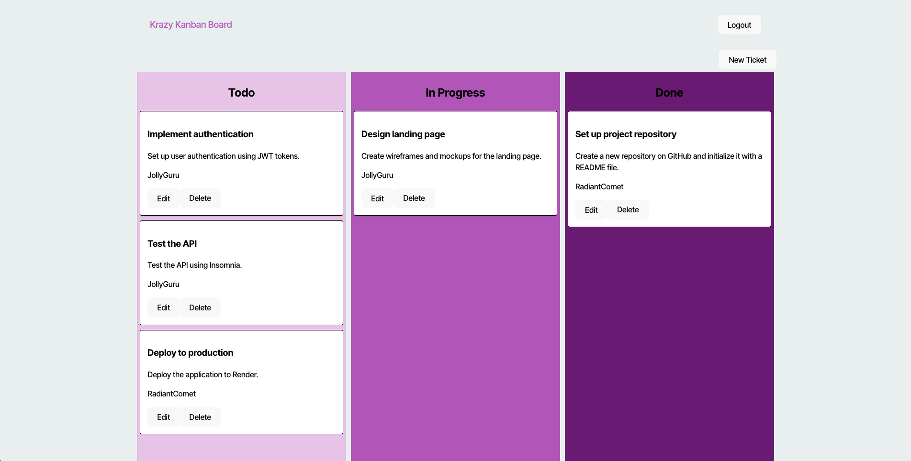

# Kanban Board


## Description 

This is a Kanban board application with secure JWT-based authentication. Users can log in, manage their tasks, and maintain a secure session. The application ensures unauthorized users cannot access task management features.

## Table of Contents 

- [Installation](#installation)
- [Usage](#usage)
- [Credits](#credits)
- [License](#license)
- [Contributing](#contributing)
- [Tests](#tests)
- [Questions](#questions) 

## Installation 

To install the application locally, follow the steps below.

1. Clone the repository:

    `https://github.com/Connorldailey/Kanban-Board.git`

2. Navigate to the project directory:

    `cd Kanban-board`

3. Install dependencies:

    `npm install`

4. Create a .env file in the server directory with the following:

    ```
        DB_USERNAME=<your_database_username>
        DB_PASSWORD=<your_database_password>
        JWT_SECRET_KEY=<your_secret_key>
    ```

5. Seed the database:

    `npm run seed`

6. Start the application in development mode:

    `npm run start:dev`

**Note**: Ensure you have the correct database credentials in the `.env` file before starting the application.

## Usage 

To use the application, visit the [live site](https://kanban-board-1gdi.onrender.com/).

- Login to the application.
- Use the Kanban board to create, update, and delete tasks.
- Log out to securely end the session.



## Credits 

Starter code was provided by The Ohio State University Coding Bootcamp.

## License 

This project is licensed under the MIT License - see the [MIT License](https://opensource.org/licenses/MIT) for details. 

## Contributing 

To contribute to the project, open a pull request with your proposed changes.

## Tests 

No automated tests were implemented. However, manual testing was conducted.

## Questions 

If you have any questions about this project, feel free to reach out: 

- **GitHub:** [connorldailey](https://github.com/connorldailey)
- **Email:** connorldailey@gmail.com
